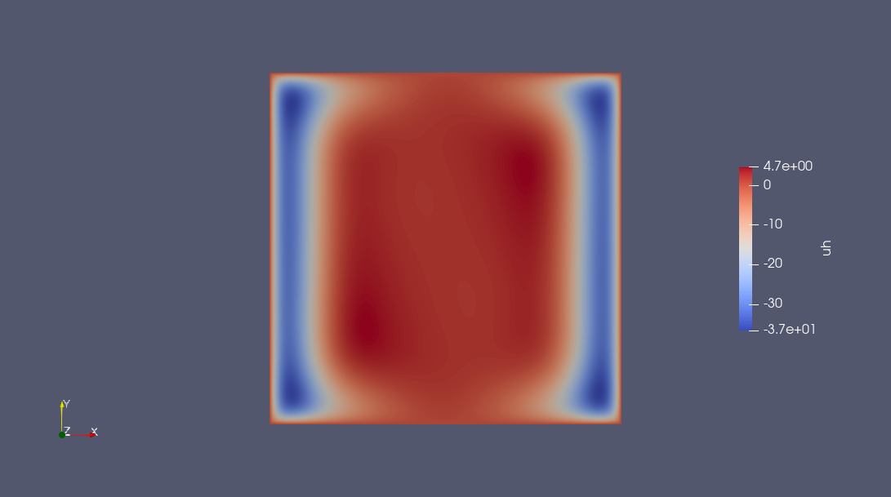

[](https://juliasmoothoptimizers.github.io/NLPModels.jl/stable/)
[](https://juliasmoothoptimizers.github.io/NLPModelsIpopt.jl/stable/)

[](https://juliasmoothoptimizers.github.io/PDENLPModels.jl/stable/)
[](https://juliasmoothoptimizers.github.io/NLPModelsModifiers.jl/stable/)
[](https://juliasmoothoptimizers.github.io/DCISolver.jl/stable/)
[](https://juliasmoothoptimizers.github.io/JSOSolvers.jl/stable/)


In this tutorial, you will learn how to use JSO-compliant solvers to solve a PDE-constrained optimization problem discretized with [PDENLPModels.jl](https://github.com/JuliaSmoothOptimizers/PDENLPModels.jl).

\toc

## Problem Statement

In this first part, we define a distributed Poisson control problem  with Dirichlet boundary conditions which is then automatically discretized.
We refer to [Gridap.jl](https://github.com/gridap/Gridap.jl) for more details on modeling PDEs and [PDENLPModels.jl](https://github.com/JuliaSmoothOptimizers/PDENLPModels.jl) for PDE-constrained optimization problems.

Let $\Omega = (-1,1)^2$, we solve the following problem:
$$
\begin{aligned}
  \min_{y \in H^1_0, u \in H^1} \quad &  \frac{1}{2 \alpha} \int_\Omega |y(x) - y_d(x)|^2dx + \frac{\alpha}{2} \int_\Omega |u|^2dx \\
  \text{s.t.} & -\Delta y = h + u, \quad x \in \Omega, \\
              & y = 0, \quad x \in \partial \Omega,
\end{aligned}
$$
where $y_d(x) = -x_1^2$ and $\alpha = 10^{-2}$.
The force term is $h(x_1, x_2) = - sin(\omega x_1)sin(\omega x_2)$ with  $\omega = \pi - \frac{1}{8}$.

```julia
using Gridap, PDENLPModels

# First, we define the domain and its discretization.
n = 100
domain = (-1, 1, -1, 1)
partition = (n, n)
model = CartesianDiscreteModel(domain, partition)

# Then, we introduce the definition of the finite element spaces.
reffe = ReferenceFE(lagrangian, Float64, 1)
Xpde = TestFESpace(model, reffe; conformity = :H1, dirichlet_tags = "boundary")
y0(x) = 0.0
Ypde = TrialFESpace(Xpde, y0)

reffe_con = ReferenceFE(lagrangian, Float64, 1)
Xcon = TestFESpace(model, reffe_con; conformity = :H1)
Ycon = TrialFESpace(Xcon)
Y = MultiFieldFESpace([Ypde, Ycon])

# Gridap also requires setting the integration machinery use to define next the objective function and the constraint operator.
trian = Triangulation(model)
degree = 1
dΩ = Measure(trian, degree)

yd(x) = -x[1]^2
α = 1e-2
function f(y, u)
  ∫(0.5 / α * (yd - y) * (yd - y) + 0.5 * α * u * u) * dΩ
end

ω = π - 1 / 8
h(x) = -sin(ω * x[1]) * sin(ω * x[2])
function res(y, u, v)
  ∫(∇(v) ⊙ ∇(y) - v * u - v * h) * dΩ
end
op = FEOperator(res, Y, Xpde)

npde = Gridap.FESpaces.num_free_dofs(Ypde)
ncon = Gridap.FESpaces.num_free_dofs(Ycon)
x0 = zeros(npde + ncon);
```


Overall, we built a GridapPDENLPModel, which implements the [NLPModel](https://juliasmoothoptimizers.github.io/NLPModels.jl/stable/) API.

```julia
nlp = GridapPDENLPModel(x0, f, trian, Ypde, Ycon, Xpde, Xcon, op, name = "Control elastic membrane")

using NLPModels

(get_nvar(nlp), get_ncon(nlp))
```

```
(20002, 9801)
```


## Find a Feasible Point

Before solving the previously defined model, we will first improve our initial guess.
The first step is to create a nonlinear least-squares whose residual is the equality-constraint of the optimization problem.
We use `FeasibilityResidual` from [NLPModelsModifiers.jl](https://github.com/JuliaSmoothOptimizers/NLPModelsModifiers.jl) to convert the NLPModel as an NLSModel.
Then, using `trunk`, a matrix-free solver for least-squares problems implemented in [JSOSolvers.jl](https://github.com/JuliaSmoothOptimizers/JSOSolvers.jl), we find an
improved guess which is close to being feasible for our large-scale problem.
By default, JSO-compliant solvers use `get_x0(nlp)` as an initial guess.

```julia
using JSOSolvers, NLPModelsModifiers

nls = FeasibilityResidual(nlp)
stats_trunk = trunk(nls, max_time = 300.0)
```

```
"Execution stats: first-order stationary"
```


We check the solution from the stats returned by `trunk`:

```julia
norm(cons(nlp, stats_trunk.solution))
```

```
4.465311648679671e-7
```


We will use the solution found to initialize our solvers.

## Solve the Problem

Finally, we are ready to solve the PDE-constrained optimization problem with a targeted tolerance of `10⁻⁵`.
In the following, we will use both Ipopt and DCI on our problem.
We refer to the tutorial [How to solve a small optimization problem with Ipopt + NLPModels](https://jso-docs.github.io/solve-an-optimization-problem-with-ipopt/)
for more information on `NLPModelsIpopt`.

```julia
using NLPModelsIpopt

# Set `print_level = 0` to avoid printing detailed iteration information.
stats_ipopt = ipopt(nlp, x0 = stats_trunk.solution, tol = 1e-5, print_level = 0)
```

```
******************************************************************************
This program contains Ipopt, a library for large-scale nonlinear optimization.
 Ipopt is released as open source code under the Eclipse Public License (EPL).
         For more information visit https://github.com/coin-or/Ipopt
******************************************************************************

"Execution stats: first-order stationary"
```


The problem was successfully solved, and we can extract the function evaluations from the stats.

```julia
nlp.counters
```

```
Counters:
             obj: █⋅⋅⋅⋅⋅⋅⋅⋅⋅⋅⋅⋅⋅⋅⋅⋅⋅⋅⋅ 6                 grad: █⋅⋅⋅⋅⋅⋅⋅⋅⋅⋅⋅⋅⋅⋅⋅⋅⋅⋅⋅ 7                 cons: █⋅⋅⋅⋅⋅⋅⋅⋅⋅⋅⋅⋅⋅⋅⋅⋅⋅⋅⋅ 13    
        cons_lin: ⋅⋅⋅⋅⋅⋅⋅⋅⋅⋅⋅⋅⋅⋅⋅⋅⋅⋅⋅⋅ 0             cons_nln: █⋅⋅⋅⋅⋅⋅⋅⋅⋅⋅⋅⋅⋅⋅⋅⋅⋅⋅⋅ 13                jcon: ⋅⋅⋅⋅⋅⋅⋅⋅⋅⋅⋅⋅⋅⋅⋅⋅⋅⋅⋅⋅ 0     
           jgrad: ⋅⋅⋅⋅⋅⋅⋅⋅⋅⋅⋅⋅⋅⋅⋅⋅⋅⋅⋅⋅ 0                  jac: █⋅⋅⋅⋅⋅⋅⋅⋅⋅⋅⋅⋅⋅⋅⋅⋅⋅⋅⋅ 7              jac_lin: ⋅⋅⋅⋅⋅⋅⋅⋅⋅⋅⋅⋅⋅⋅⋅⋅⋅⋅⋅⋅ 0     
         jac_nln: █⋅⋅⋅⋅⋅⋅⋅⋅⋅⋅⋅⋅⋅⋅⋅⋅⋅⋅⋅ 7                jprod: ████████████████████ 1127         jprod_lin: ⋅⋅⋅⋅⋅⋅⋅⋅⋅⋅⋅⋅⋅⋅⋅⋅⋅⋅⋅⋅ 0     
       jprod_nln: ████████████████████ 1127            jtprod: ████████████████████ 1133        jtprod_lin: ⋅⋅⋅⋅⋅⋅⋅⋅⋅⋅⋅⋅⋅⋅⋅⋅⋅⋅⋅⋅ 0     
      jtprod_nln: ████████████████████ 1133              hess: █⋅⋅⋅⋅⋅⋅⋅⋅⋅⋅⋅⋅⋅⋅⋅⋅⋅⋅⋅ 5                hprod: ⋅⋅⋅⋅⋅⋅⋅⋅⋅⋅⋅⋅⋅⋅⋅⋅⋅⋅⋅⋅ 0     
           jhess: ⋅⋅⋅⋅⋅⋅⋅⋅⋅⋅⋅⋅⋅⋅⋅⋅⋅⋅⋅⋅ 0               jhprod: ⋅⋅⋅⋅⋅⋅⋅⋅⋅⋅⋅⋅⋅⋅⋅⋅⋅⋅⋅⋅ 0
```


Reinitialize the counters before re-solving.

```julia
reset!(nlp);
```


Most JSO-compliant solvers are using logger for printing iteration information. 
`NullLogger` avoids printing iteration information.

```julia
using DCISolver, Logging

stats_dci = with_logger(NullLogger()) do
  dci(nlp, stats_trunk.solution, atol = 1e-5, rtol = 0.0)
end
```

```
"Execution stats: first-order stationary"
```


The problem was successfully solved, and we can extract the function evaluations from the stats.

```julia
nlp.counters
```

```
Counters:
             obj: █⋅⋅⋅⋅⋅⋅⋅⋅⋅⋅⋅⋅⋅⋅⋅⋅⋅⋅⋅ 7                 grad: █⋅⋅⋅⋅⋅⋅⋅⋅⋅⋅⋅⋅⋅⋅⋅⋅⋅⋅⋅ 7                 cons: █⋅⋅⋅⋅⋅⋅⋅⋅⋅⋅⋅⋅⋅⋅⋅⋅⋅⋅⋅ 7     
        cons_lin: ⋅⋅⋅⋅⋅⋅⋅⋅⋅⋅⋅⋅⋅⋅⋅⋅⋅⋅⋅⋅ 0             cons_nln: █⋅⋅⋅⋅⋅⋅⋅⋅⋅⋅⋅⋅⋅⋅⋅⋅⋅⋅⋅ 7                 jcon: ⋅⋅⋅⋅⋅⋅⋅⋅⋅⋅⋅⋅⋅⋅⋅⋅⋅⋅⋅⋅ 0     
           jgrad: ⋅⋅⋅⋅⋅⋅⋅⋅⋅⋅⋅⋅⋅⋅⋅⋅⋅⋅⋅⋅ 0                  jac: █⋅⋅⋅⋅⋅⋅⋅⋅⋅⋅⋅⋅⋅⋅⋅⋅⋅⋅⋅ 13             jac_lin: ⋅⋅⋅⋅⋅⋅⋅⋅⋅⋅⋅⋅⋅⋅⋅⋅⋅⋅⋅⋅ 0     
         jac_nln: █⋅⋅⋅⋅⋅⋅⋅⋅⋅⋅⋅⋅⋅⋅⋅⋅⋅⋅⋅ 13               jprod: ████████████████████ 10895        jprod_lin: ⋅⋅⋅⋅⋅⋅⋅⋅⋅⋅⋅⋅⋅⋅⋅⋅⋅⋅⋅⋅ 0     
       jprod_nln: ⋅⋅⋅⋅⋅⋅⋅⋅⋅⋅⋅⋅⋅⋅⋅⋅⋅⋅⋅⋅ 0               jtprod: ████████████████████ 10895       jtprod_lin: ⋅⋅⋅⋅⋅⋅⋅⋅⋅⋅⋅⋅⋅⋅⋅⋅⋅⋅⋅⋅ 0     
      jtprod_nln: ⋅⋅⋅⋅⋅⋅⋅⋅⋅⋅⋅⋅⋅⋅⋅⋅⋅⋅⋅⋅ 0                 hess: █⋅⋅⋅⋅⋅⋅⋅⋅⋅⋅⋅⋅⋅⋅⋅⋅⋅⋅⋅ 5                hprod: ⋅⋅⋅⋅⋅⋅⋅⋅⋅⋅⋅⋅⋅⋅⋅⋅⋅⋅⋅⋅ 0     
           jhess: ⋅⋅⋅⋅⋅⋅⋅⋅⋅⋅⋅⋅⋅⋅⋅⋅⋅⋅⋅⋅ 0               jhprod: ⋅⋅⋅⋅⋅⋅⋅⋅⋅⋅⋅⋅⋅⋅⋅⋅⋅⋅⋅⋅ 0
```


We now compare the two solvers with respect to the time spent,

```julia
stats_ipopt.elapsed_time, stats_dci.elapsed_time
```

```
(66.498, 18.329838037490845)
```


and also check objective value, feasibility, and dual feasibility of `ipopt` and `dci`.

```julia
(stats_ipopt.objective, stats_ipopt.primal_feas, stats_ipopt.dual_feas),
(stats_dci.objective, stats_dci.primal_feas, stats_dci.dual_feas)
```

```
((16.044043741825803, 2.740863092043355e-16, 6.754773183374242e-6), (16.040271504407357, 5.628478048695899e-10, 7.394013205487982e-8))
```


Overall `DCISolver` is doing great for solving large-scale optimization problems!
You can try increase the problem size by changing the discretization parameter `n`.

Finally, switching the discrete solution as a `FEFunction` the result can written as a VTK-file using Gridap's facilities.

```julia
yfv = stats_dci.solution[1:Gridap.FESpaces.num_free_dofs(nlp.pdemeta.Ypde)]
yh  = FEFunction(nlp.pdemeta.Ypde, yfv)

ufv = stats_dci.solution[1+Gridap.FESpaces.num_free_dofs(nlp.pdemeta.Ypde):end]
uh  = FEFunction(nlp.pdemeta.Ycon, ufv)

writevtk(nlp.pdemeta.tnrj.trian, "results", cellfields = ["uh" => uh, "yh" => yh])
```

```
(["results.vtu"],)
```


The following plots can obtained using any software reading VTK, e.g. Paraview.



